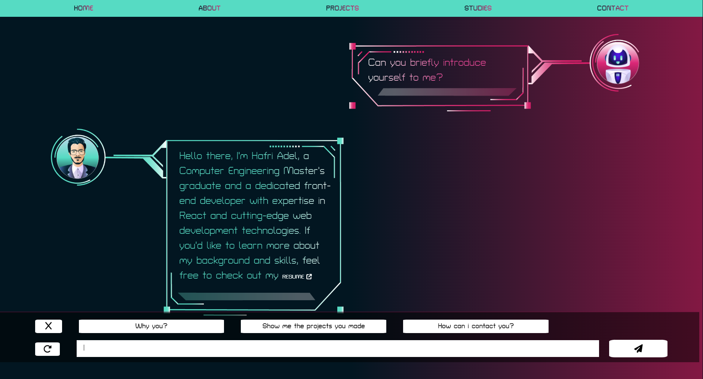
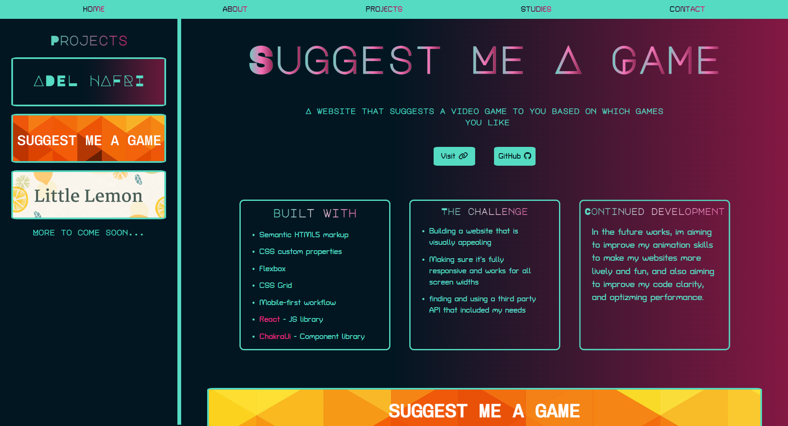
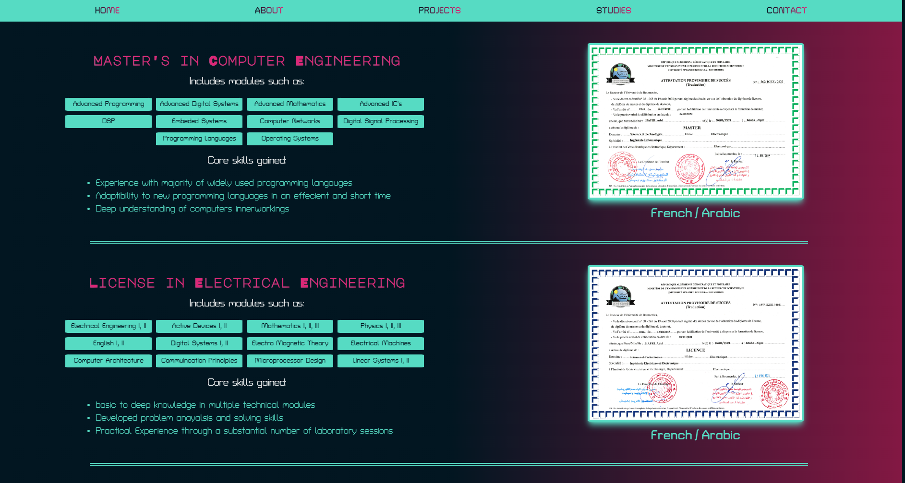
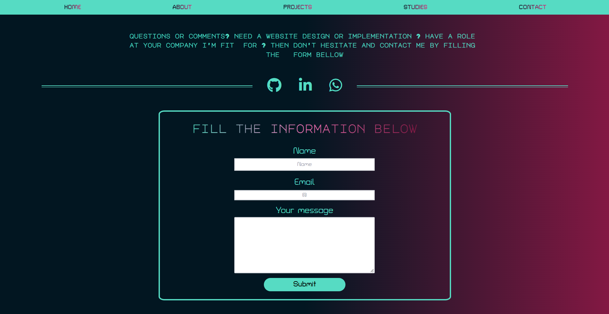

# Adel Hafri Portfolio Website

My own portfolio website that utilizes a varied number of creative ideas per page to showcase my skills in frontend web development

## Table of contents

- [Overview](#overview)
  - [The challenge](#the-challenge)
  - [Screenshot](#screenshot)
  - [Links](#links)
- [My process](#my-process)
  - [Built with](#built-with)
  - [What I learned](#what-i-learned)
  - [Continued development](#continued-development)
  - [Useful resources](#useful-resources)
- [Author](#author)

## Overview

### The challenge

- Building a website with a different creative idea for each page
- Making sure it's fully responsive and works for all screen widths
- Building a website that is visually appealing and easy to navigate at the same time

### Screenshot

### Links

- Live Site URL: (https://ladel46.github.io/Suggest-Me-A-Game)

## My process

### Built with

- Semantic HTML5 markup
- CSS custom properties
- Tailwind CSS
- Flexbox
- CSS Grid
- React - JS library
- TailwindCss - CSS framework
- FramerMotion - Animations
- Figma - Mockup designing
- EmailJs - Mail sending

### What I learned

By doing this project, i learned many different new skills in web development, like creating a chat app or an interactive robot that follows the user inputs, i also improved my animations skills and implemented a number of animations throughout the site that made it more lively, and lastely i improved my use of REACT and managing my code in different components.

### Continued development

In the future works, im aiming to further improve my code clarity, and making more optimizations for performance.

### Useful resources

- [TailWindCss documentation](https://tailwindcss.com/docs/installation) - This made using TailWindCss very easy and straight forward, as long as you have the CSS knowledge trainsitioning to TailWind is simple.
- [Framer Motion documentation](https://www.framer.com/motion/) - Framer motion made making animations much simpler and their documntation are perfect for any type of idea you have in mind.
- [W3Schools Css Refrence](https://www.w3schools.com/cssref/index.php) - Its has any questions you might have of Css answered with live examples, very good for any type of Css research.

## Author

- LinkedIn - [Adel Hafri](https://www.linkedin.com/in/adel-hafri/)
